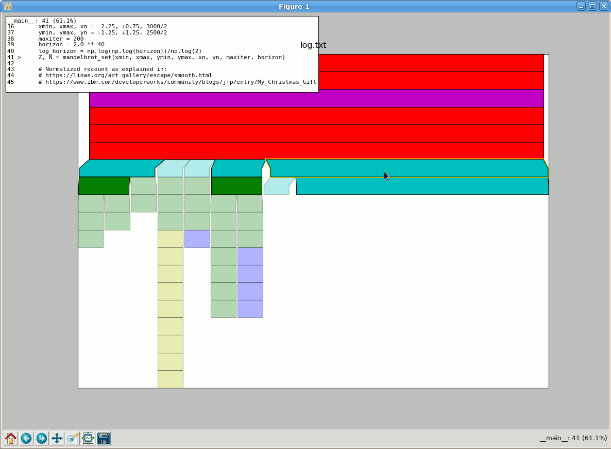

# Kapture: a simple sampling profiler for Python

## Introduction

Kapture is a simple implementation of a time-sampling profiler, written in pure Python.
It includes a graphical representation of the results (based upon matplotlib) to easily
investigate bottlenecks and hot-spots.

## Installation

Kapture currently needs to run inside the installation of Python you wish to profile.
It is written in pure python and depends only on the standard library (mostly pdb).
The visualisation component of kapture depends on matplotlib and numpy.

Kapture can be pip installed with:

    pip install kapture

Kapture can be installed from the source directory with:

    pip install .

    OR

    python setup.py install

## Usage

Once installed, kapture's usage is:

    python -m kapture [-l LOG] (-c command | -m module-name | script) [args]

For example, the profile of [matplotlib's mandelbrot example](
https://matplotlib.org/examples/showcase/mandelbrot.html):

    $ python -m kapture ~/Downloads/mandelbrot.py
    Pausing for user process to start...
    Sample #1
    Sample #2
    Sample #3
    Sample #4
    Sample #5
    Sample #6
    Sample #7
    Sample #8
    Sample #9
    Sample #10
    Sample #11
    Sample #12
    Sample #13
    Sample #14
    Sample #15
    Sample #16
    Sample #17
    Sample #18
    Killing
    Traceback (most recent call last):
      File "kapture/__main__.py", line 55, in <module>
          main(sys.argv[1:])
      File "kapture/__main__.py", line 32, in main
          process.kill()
      File "/opt/scitools/environments/default/2018_05_22-1/lib/python2.7/subprocess.py", line 1572, in kill
          self.send_signal(signal.SIGKILL)
      File "/opt/scitools/environments/default/2018_05_22-1/lib/python2.7/subprocess.py", line 1562, in send_signal
          os.kill(self.pid, sig)
    OSError: [Errno 3] No such process

Whilst this is somewhat messy standard out, the result is a ``log.txt``
([see example log](docs/example_log.txt)) documenting the sampled profile.
We can take a look at this with:

    $ python -m kapture.blockview -l log.txt

Unlike tools like pyflame, we visualise the blocks descending from the top.
Therefore the very top box is the invocation, and the lowest blocks are the deepest calls in the stack.
Clicking on the individual boxes gives us some context of the call stack, and a helpful preview of the code
that ran.

## Alternatives

Kapture was written at the Met Office in order to profile a complex python codebase.
It was originally written in 2012 before a number of other tools were available.
These other tools fill a similar space, and may also be worth considering when
profiling your python codes:

 * https://github.com/uber/pyflame
 * https://github.com/what-studio/profiling

## License

Kapture is available under a BSD 3-clause license.
